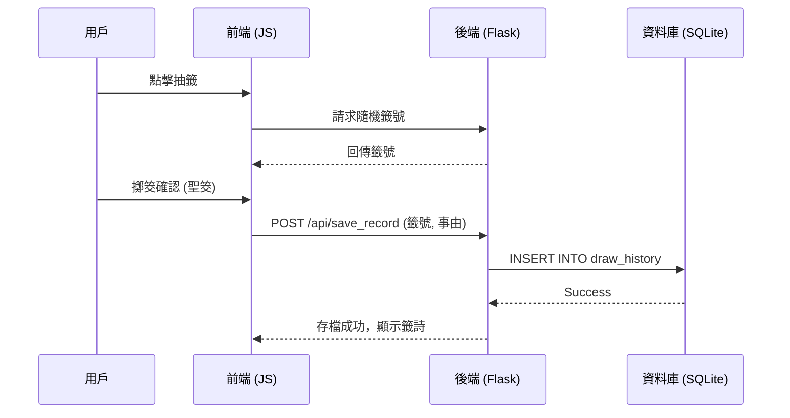
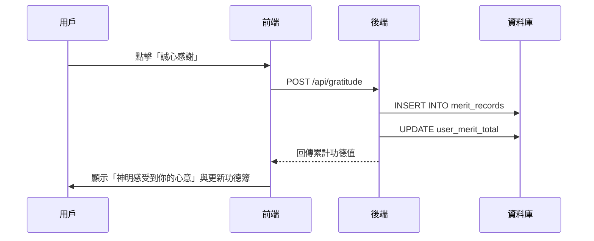

# 架構設計文件 (Architecture Design)

## 1. 技術棧 (Tech Stack)
- **後端 (Backend)**: Python Flask
- **前端 (Frontend)**: HTML5, Vanilla CSS, JavaScript (ES6+)
- **資料儲存 (Data)**: 
    - **靜態資料**: `poems.json` (60 首甲子籤詩內容)。
    - **動態資料**: **SQLite3** (儲存用戶抽籤歷史、個人功德簿與感恩紀錄)。
- **部署/環境**: Python 3.x, Flask, Flask-SQLAlchemy (建議選用以便管理資料庫)。

---

## 2. 專案目錄結構 (Project Structure)
```text
.
├── app.py              # Flask 進入點、路由設計
├── database.py         # 資料庫模型與初始化邏輯 [NEW]
├── requirements.txt    # 依賴: Flask, Flask-SQLAlchemy
├── docs/
│   ├── PRD.md
│   └── ARCHITECTURE.md
├── static/
│   ├── css/
│   │   └── style.css   # Premium 視覺與動畫樣式
│   ├── js/
│   │   └── main.js    # 儀式流程控制、AJAX 調用後端存檔
│   └── images/
├── templates/
│   └── index.html
├── data/
│   ├── poems.json      # 籤詩靜態庫
│   └── temple.db       # SQLite 資料庫檔案 [NEW]
└── models/             # 若邏輯複雜可獨立存放 Model
```

---

## 3. 系統組件說明 (Component Description)

### 3.1 前端互動 (Interaction Layer)
- **Ceremony Controller**: 控制參拜、擲筊、抽籤的動畫序列。
- **History Viewer**: 透過 AJAX 向後端請求歷史紀錄並渲染於功德簿頁面。
- **Gratitude Module**: 提供「誠心感謝」互動介面，並即時更新功德總覽。

### 3.2 業務邏輯層 (Service Layer)
- **Ritual Engine**: 負責隨機機率計算（擲筊與抽籤）。
- **Merit Service**: 處理感恩記數邏輯、功德等級判定。

### 3.3 數據持久化層 (Persistence Layer)
- **SQLAlchemy Models**: 定義資料表結構。
- **Data Access Objects (DAO)**: 提供讀取歷史與寫入紀錄的介面。

---

## 4. 關鍵數據流與流程 (Key Flows)

### 4.1 求籤並存檔流程


### 4.2 感恩功德流程


---

## 5. 資料模型設計 (Data Models)

### 5.1 DrawHistory (抽籤歷史)
- `id`: Primary Key
- `timestamp`: DateTime (紀錄時間)
- `category`: String (問事類別)
- `poem_id`: Integer (籤號 1-60)
- `result_summary`: Text (簡單註記)

### 5.2 MeritRecord (功德/感恩紀錄)
- `id`: Primary Key
- `timestamp`: DateTime
- `merit_points`: Integer (功德點數)
- `comment`: String (祈福內容)

---

## 6. 安全與效能 (Security & Performance)
- **安全性**: 
    - 使用參數化查詢防止 SQL 注入。
    - 敏感操作（如累積功德）應具備基本的防重送機制。
- **效能**:
    - SQLite 適合單機/低併發場景，完全能滿足本專案需求。
    - 籤詩 JSON 在伺服器啟動時一次性加載至內存，加快讀取速度。
